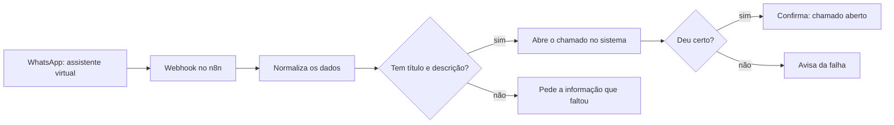
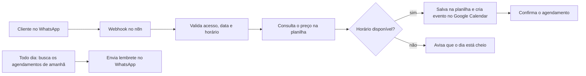

---

Me chamo **Pedro Souza Ramos**, tenho 18 anos e moro em São Paulo - SP. Atualmente curso Análise e Desenvolvimento de Sistemas (ADS) na UNICSUL, e estou no segundo semestre. Tenho muito interesse por tecnologia e hardware, e hoje trabalho como gestor de automação e desenvolvedor.

---

### Connect with me!

### My Stack ~

    

 

### My Automations ~

Alguns fluxos que mantenho no dia a dia com o **n8n**:

**Atendimento e chamados pelo WhatsApp**
Um assistente virtual recebe a solicitação do usuário no WhatsApp e o n8n abre o chamado direto no sistema de suporte. Antes disso, valida os dados e avisa se deu certo ou se faltou alguma informação.
*Conecta:* WhatsApp → n8n → API do sistema de chamados

Ver como funciona

**Agendamento automático para pet shop**
Clientes agendam serviços e consultas pelo WhatsApp. O fluxo consulta o preço do serviço, verifica a disponibilidade do dia, registra o agendamento na planilha, cria o evento na agenda e envia lembretes no dia anterior.
*Conecta:* WhatsApp → n8n → Google Sheets → Google Calendar

Ver como funciona

### GitHub Stats

